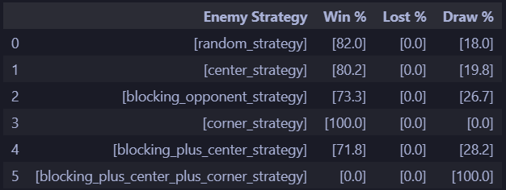

# Lab 10 

## Reinforcement Learning using Monte Carlo Method
Monte Carlo method on the other hand is a very simple concept where agent learn about the states and reward when it interacts with the environment.
Only after a complete episode(game), values(each state that we had encounterad in the game) are updated with a reward by the following formula:  

Old_Value= Old_Value+ epsilon * (reward - Old_value)

           

### State
The state is represented as a tuple of two set (x_move,o_move), while x_move contains a list of  integer numbers indicating the cell in which there is a  X, and o_move contains the 'O' positions.

State example:

`([0,1,2],[3,4,5])`

## Action space
An action is represented by an integer number indicating the cell in which the agent wants to put its X.
   
Action space:
 `0,1,2,3,4,5,6,7,8`

### Rewards
Given a state and an action the following rewards are assigned:

Win reward: 1
Lose reward: -1
Draw reward: 0

## Benchmark suite
In order to evaluate the solution obtained  by RL-MonteCarlo Method, i created a benchmark suite.

### Random Strategy
- Description: Select a random available move
- Implementation: The player makes a move without considering the game state, purely based on randomness.

### Center Strategy
- Description: Select the center square if it is empty
- Implementation: The player prioritizes the center square when making a move.

### Blocking Opponent Strategy
- Description: Block the opponent's winning move
- Implementation: The player analyzes the opponent's potential winning moves and places their piece to prevent the opponent from winning.

### Corner Strategy
- Description: Select one corner if available
- Implementation: The player prioritizes placing their piece in one of the corners of the board.

### Plus Strategy
- Description: Mix of two or more strategies based on the game state
- Implementation: The player combines the approaches of two or more strategies, potentially adjusting the mix based on the game state.

## Training
The training has been done against an opponent who used  the random_strategy, for a total of 8_000_000 games.

  
## Test
Test are evaluated on 1_000 games  for each benchmark.

## Have fun
Made with ❤️ by [Michelangelo Caretto](https://github.com/rasenqt/computational_intelligence23_24) 
