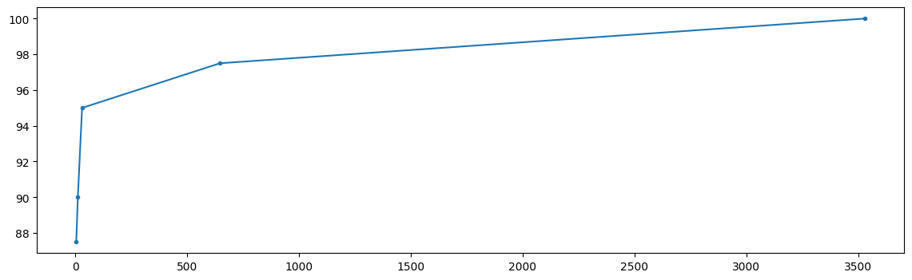

# Evolutionary strategies for playing Nim Reverse

## Intro problem
The Nim Reverse Problem is a classic combinatorial game where two players take turns removing objects from distinct heaps. The twist in Nim Reverse is that the last player to make a move wins instead of losing. The goal is to strategically manipulate the game's state to force your opponent into a position where they must make the final move.
Moreover, we implented the k-version, in which we can take a maximum number of elements (k) in each pile.

## Solution space
Our solution space is represented by means of a "Weights" class, which has as an attribute, a list of tuples composed of a weight and a callable function (called also "rule").

## ES implementation
To implement the Nim Reverse Problem as an evolutionary strategy we followed the following steps:
 - Representation of Individuals: we define a representation for individuals in the population as described in the solution space;

 - Initialization: we initialize the population according to a random value taken from a normal distribution with parameters with mean=0 and standard deviation=sigma (variable 'o'). In particular, we used a "mutate_weights" method from the "Weight" class, which takes as an argument a vector of floating point numbers and mutates the initialized weights (all zeros initially) by summing them to a certain quantity (based on the vector parameter).

 - Fitness Function: we evaluate our solutions (and so our weights combination) using the percentage of won games, out of the total number of played games, as a metric;

 - Selection: starting from the best solution, we generate λ new individuals, and according to the fitness value of them we take the maximum one of the current generation. After that, we check also wether the current (generation) best solution is better than the global best one.

 - Mutation: thanks to the "mutate" function, we manage to generate as many individuals as λ acoording to the same criterion described in the previous "Initialization" point;

 - Replacement: if the current generation best solution (set of weights) is better than the one we started from, we replace it. 

 - Termination: we run a cycle composed by N integer division λ

 Therefore, we adopted a Vanilla (1 + λ) ES.

## Developed strategies
# Enemy strategies
 - very_optimal_k: it looks for the number of pile swhich are greater than 1. If there's more than one pile in this case, it tries to find a move that has a nim sum equal to zero. Otherwise it tries to leave an odd number of active piles according to the "k" constrains.

 - pure_random_k, gabriele_k, optimal_k : strategies already written from the teacher assistant and modified fot the k-variant;

# Our strategies
 - odd_piles_strategy: it seeks for a move that leaves the game with an odd number of piles, which do not differ to much between each other. The goal at which we aim here, is to find an optimal setting that could lead us the victory (e.g. if we make a move that let 3 piles contain 1 element each, then we win);

 - mirror: it tries to mirror the previous move of the enemy, if the left objects are greater than a certain percentage out of the total number of objects and the previous move actually exist.

 - odd_even: if the number of active piles are even, it tries to take an odd number of objects and viceversa. 

 - final_move: it tries to leave an odd number of active piles according to the "k" constrains if there's only one pile with more than one object.

# How to choose a move
Every strategy is represented by a tuple composed of a real number (the weight) and a callable function, which represents how we select a move for a specific strategy.
For each move we assign a different weight, and the final move will be the one with the higher weight. In case we have the same move with different weight, we add up the weights and consider them as a single move.

## Final results
In the end, we can compare the initial weight value with the current one, and notice how the weights have been changed based on which rule has been the "strongest": this means that this rule has been used a lot in order to get "locally" to the best configuration.

An example could be the following:
Parameters used for the ES:
- λ = 2 
- o = 0.001 
- num_iteration=8000 

Parameters used for the Nim game:
- k=2 
- nim_dimension=7 
- games_x_player=10

Final Weights:
(2.987558299220918, odd_piles_strategy),
(-0.21735082385675966,  odd_even),
(-2.1927265070330964, mirror), 
(1.5258450101105046, final_move )

Concerning what we can see fro mthe plot, the eney strategy is not optimal because since the very first iterations we managed to obtain a dscrete winning rate and due to the big number of iterations, we achieved the global maximum.
In the following plot we have on the y axis the fitness percentage, while on the x axis we have the number of iterations.

## Have fun
Made with ❤️ love by [Michelangelo Caretto](https://github.com/rasenqt/computational_intelligence23_24) and [Silvio Chito](https://github.com/SilvioChito/computational_intelligence)   