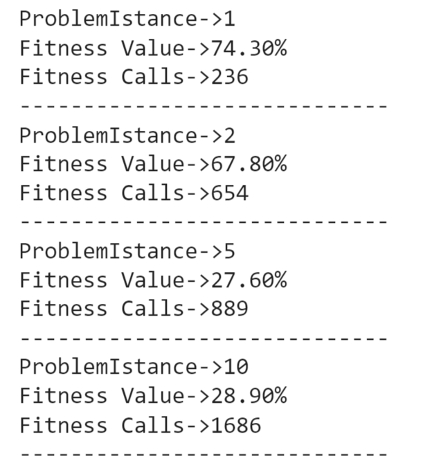

# Lab 9 

## Problem introduction
Write a local-search algorithm (eg. an EA) able to solve the *Problem* instances 1, 2, 5, and 10 on a 1000-loci genomes, using a minimum number of fitness calls.

# Solution proposal
Our solution is represented by an evolutionary algorithm with some particularities, which let it work with less fitness calls.

## Entropy and Hamming distance
In order to call the fitness function less times, we tried to figure out a way to classify our individuals based not only on fitness, but also on other metrics: entropy and hamming distance.

The Hamming distance represents for binary vectors, how much they differ between each other on average. This is helpful for retaining diversity inside the population of individuals, but on the other hand, it is also computational expensive (e.g. if we have a population of 50 individuals, we should take into account 50*50 different distances).

Entropy instead, in this context, is a measure of the amount of uncertainty or disorder represented by the vector itself.

## Algorithmic details

We start with a beginning population of a certain size, over which we compute the fitness function. Once we have set the initial best solution based on the fitness of the initial population, we begin the evolutionary process by reproducing OFFSPRING_SIZE offsprings by using a mutation (under a certain probability) or a crossover. 

Then, we sort the offsprings based on a certain metric, in order to avoid computing a fitness function for each individual: we try to choose 'the best' even if we do not know it in advance (OFFSPRING_SIZE_FILTERED individua).

We used the entropy metric for the final results, since it reached a good trade-off between a good fitness score and the number of the fitness function calls. 
We have tried also the other metrics mentioned before, and they all performed not well enough.

We left also the other fuction in the python notebook, if you wish to test the other implementations (with the hamming metric and the combination of hamming and entropy).

In order to boost the number of saved fitness calls, we saved the fitness scores of all the individuals analyzed inside a dictionary (in order to not compute the same value twice).

After we added the offsprings (over which we computed the fitness scores) and choose POPULATION_SIZE individuals that will compose the next generation. 

***The words written in capital letters represents variables in the code.

The following are the results of the algorithm:

## Have fun
Made with ❤️ by [Michelangelo Caretto](https://github.com/rasenqt/computational_intelligence23_24) and [Silvio Chito](https://github.com/SilvioChito/computational_intelligence)
